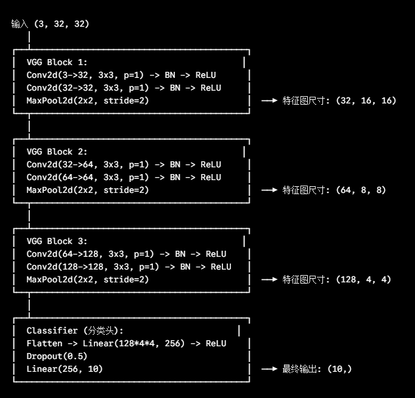

# VGG
- VGG 的核心思想是用多个小卷积核堆叠代替大卷积核
- 多个 3 * 3 卷积可以扩大感受野，同时引入更多非线性激活
- 小卷积核堆叠通常比直接使用大卷积核参数更少，表达能力更强

# 感受野
- 感受野指特征图上某个位置能“看到”的原始输入图像区域范围
- 两个连续的 3 * 3 卷积可以获得类似 5 * 5 的感受野
- 三个连续的 3 * 3 卷积可以获得类似 7 * 7 的感受野

# VGGBlock
- Day10 中封装了一个可复用的 `VGGBlock`
- 每个 Block 结构为：`Conv -> BN -> ReLU -> Conv -> BN -> ReLU -> MaxPool`
- 两次 3 * 3 卷积负责提取特征，最后的 2 * 2 最大池化负责降采样

# 面向 CIFAR-10 的 VGG-Slim 架构
- 输入图片尺寸为 `3x32x32`
- 第 1 个 VGGBlock：`3x32x32 -> 32x16x16`
- 第 2 个 VGGBlock：`32x16x16 -> 64x8x8`
- 第 3 个 VGGBlock：`64x8x8 -> 128x4x4`
- 分类头：`Flatten -> Linear(2048, 256) -> ReLU -> Dropout -> Linear(256, 10)`
- 架构图：

# 参数量统计
- 代码中使用 `sum(p.numel() for p in model.parameters() if p.requires_grad)` 统计可训练参数量
- 参数量是后续轻量化实验的重要基线
- VGG-Slim 比 SimpleCNN 更深，但仍然比完整 VGG 小很多，适合 CIFAR-10 学习项目

# 为什么输出是 logits
- 最后一层 `Linear(256, 10)` 输出 10 个类别分数
- 这些分数还不是概率，而是 logits
- 训练时交给 `CrossEntropyLoss`，它内部会完成 Softmax 相关计算

# 今日自查问题
- 为什么 VGG 喜欢连续堆叠 3 * 3 卷积？
- VGG-Slim 三次池化后，32x32 为什么变成 4x4？
- 为什么分类头第一层 Linear 的输入维度是 `128 * 4 * 4`？
