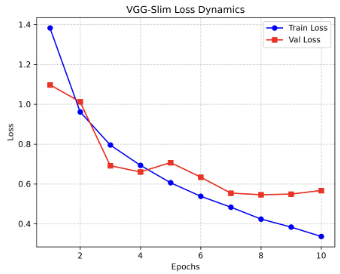
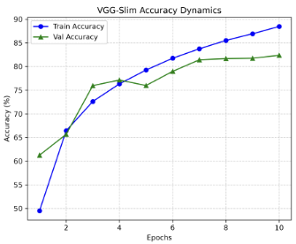

# 训练曲线可视化
- Day12 的目标是记录每个 Epoch 的训练指标，并用 Matplotlib 画出曲线
- 曲线可以帮助判断模型是否正常收敛、是否过拟合、是否需要调参
- 这一步是项目从“能跑代码”走向“能做实验分析”的关键

# history 字典
- 代码中使用 `history` 保存四类指标
- `train_loss`：训练集平均损失
- `val_loss`：验证集平均损失
- `train_acc`：训练集准确率
- `val_acc`：验证集准确率

# Loss Dynamics
- Loss 曲线反映模型优化目标的变化
- Train Loss 持续下降，说明模型在训练集上拟合得越来越好
- Val Loss 如果先下降后上升，通常说明模型开始过拟合
- Loss 曲线记录：

# Accuracy Dynamics
- Accuracy 曲线反映分类正确率变化
- Train Accuracy 和 Val Accuracy 一起看，才能判断泛化情况
- 如果 Train Accuracy 很高但 Val Accuracy 明显低，说明可能过拟合
- Accuracy 曲线记录：

# 绘图细节
- `plt.subplot(1, 2, 1)` 表示一行两列中的第一个子图
- `marker` 可以让每个 Epoch 的数据点更清楚
- `plt.grid()` 增加网格线，方便观察趋势
- `plt.tight_layout()` 可以减少子图重叠
- `plt.savefig(..., dpi=300)` 保存高清图片，适合放进 README 或实验报告

# 为什么曲线比单个数字重要
- 单个最高准确率只能说明最终结果
- 曲线能展示训练过程是否稳定、是否震荡、是否过拟合
- 复试中能解释曲线，往往比只报准确率更能体现科研思维

# 今日自查问题
- 如果 Train Loss 下降但 Val Loss 上升，说明什么？
- 如果 Train Acc 和 Val Acc 都很低，可能是什么原因？
- 为什么 README 中应该放训练曲线，而不仅是最终准确率？
