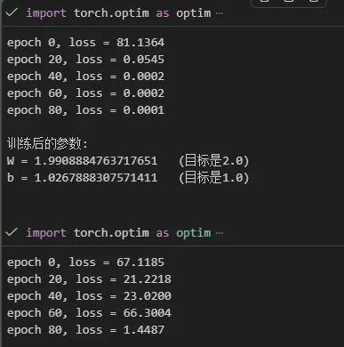

# 结果
- 

# 训练曲线与实验记录
- Day22 将 Day21 保存的 JSON 指标转换成 CSV，并绘制 Loss 和 Accuracy 曲线
- 曲线比单个最终数字包含更多信息，可以观察收敛速度、训练稳定性和过拟合趋势
- 这一步开始形成完整的实验记录闭环：训练 -> 保存指标 -> 可视化 -> 分析结论

# Loss 曲线分析
- Train Loss 从 1.7205 下降到 0.8736，说明模型持续学习到了训练集中的有效模式
- Val Loss 从 1.3537 下降到 0.8040，整体趋势也在下降，说明泛化能力没有明显恶化
- 第 8 个 Epoch 附近 Val Loss 有小幅波动，但后续又继续下降，暂时不能直接判断为过拟合

# Accuracy 曲线分析
- Train Acc 从 35.38% 提升到 68.63%
- Val Acc 从 51.12% 提升到 72.18%
- 当前最高 Val Acc 出现在第 10 个 Epoch，为 72.18%
- 训练集准确率低于验证集准确率并不一定是错误，因为训练阶段 Dropout 处于开启状态，而验证阶段 Dropout 已关闭

# 泛化差距
- 泛化差距可以粗略定义为：`Train Acc - Val Acc`
- Day21 第 10 个 Epoch 的差距约为 `68.63% - 72.18% = -3.55%`
- 这里出现负值，主要和训练阶段 Dropout 的随机失活有关，不能机械地按“验证集比训练集高就是数据泄漏”判断
- 更严谨的做法是训练结束后再用 `model.eval()` 对训练集重新评估一次

# CSV 记录
- JSON 适合程序读取，CSV 更适合用 Excel 或 Matplotlib 做实验整理
- 每一行对应一个 Epoch
- 每一列记录 Epoch、Train Loss、Train Acc、Val Loss、Val Acc
- 后续可以把多个模型的最佳结果汇总到同一张实验表中

# 当前阶段实验结论
- LightVGG-Slim 在 563,403 个可训练参数下，10 Epoch 达到 72.18% 的最高验证准确率
- 它的特征提取部分参数量远低于 VGG-Slim，但分类头仍然占据大量参数
- 当前结果说明深度可分离卷积可以在保持输出形状不变的同时减少模型复杂度
- 是否值得继续优化，还要和 VGG-Slim 的准确率、训练时间、模型大小进行对照

# 今日自查问题
- 为什么不能只看最后一个 Epoch 的准确率？
- Val Loss 小幅波动但整体下降，应该如何判断？
- 为什么训练阶段的 Train Acc 可能低于验证阶段的 Val Acc？
- CSV 和 JSON 在实验记录中分别适合什么场景？
