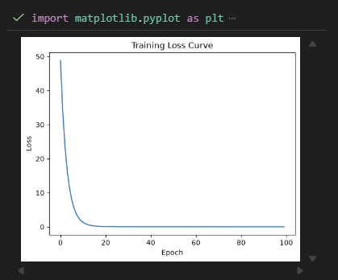
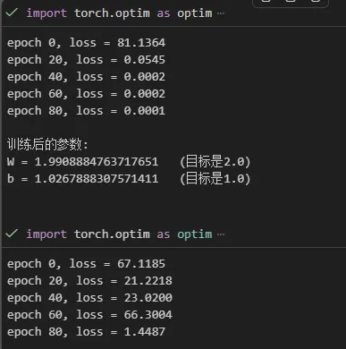

## 完整收获
1. Linear层的数学本质：y = xW + b，W存储形状是(out_features, in_features)，实际用转置计算，这是为了配合batch输入的设计习惯
2. MSE损失函数：预测值与真实值差值的平方再取平均，惩罚大误差更重
3. SGD优化器：新参数 = 旧参数 - lr × 梯度，这是最基础的参数更新规则
4. 完整训练闭环：前向传播 → 算loss → zero_grad → backward → step，这五步你以后写任何模型的训练循环，结构都是一模一样的，CNN也不例外
5. 亲手复现了梯度累积bug，并用真实数据（loss震荡 vs 平滑收敛）验证了zero_grad()的必要性
6. 用Matplotlib画出了一条loss曲线：

## 训练过程代码详解
1、nn.MSELoss() ：MSE = Mean Squared Error（均方误差），公式：loss = 平均( (预测值 - 真实值)² )
2、optim.SGD(model.parameters(), lr=0.01) ：
- model.parameters()：把模型里所有requires_grad=True的参数打包给优化器管理；
- SGD（随机梯度下降）：一种参数更新规则，公式：新参数 = 旧参数 - 学习率 × 梯度；
- lr=0.01：学习率，控制"每一步调整的步子迈多大"；
3、optimizer.zero_grad()的作用：
- 