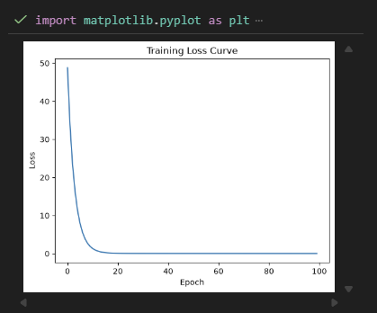

## 今日学习目标
- 理解 Linear 层的数学本质
- 亲手完成一个最小训练闭环：前向传播、计算 loss、反向传播、参数更新
- 通过故意不写 `zero_grad()` 复现梯度累加问题
- 使用 Matplotlib 记录并绘制 loss 曲线

## Linear 层的数学本质
- 线性层本质是矩阵乘法加偏置：`y = xW + b`
- 手写版本中，`W` 的形状是 `(3, 2)`，输入 `x` 的形状是 `(3,)`，输出是 2 维向量
- PyTorch 的 `nn.Linear(in_features=3, out_features=2)` 会自动创建权重和偏置
- 在 PyTorch 中，`linear_layer.weight` 的存储形状是 `(out_features, in_features)`，实际计算时内部会转置

## 训练数据
- 代码中构造了一个最简单的线性关系：`y = 2x + 1`
- `x_train` 形状为 `(4, 1)`，表示 4 个样本，每个样本 1 个特征
- `y_train` 形状也为 `(4, 1)`，表示每个样本对应的真实值

## MSE 损失函数
- `nn.MSELoss()` 表示均方误差损失
- 公式：`loss = 平均((预测值 - 真实值) ** 2)`
- MSE 会对大误差给予更重惩罚，适合回归任务

## SGD 优化器
- `optim.SGD(model.parameters(), lr=0.01)` 负责根据梯度更新模型参数
- `model.parameters()` 会把模型中所有可训练参数交给优化器管理
- 参数更新公式：`新参数 = 旧参数 - 学习率 * 梯度`
- 学习率 `lr` 控制每次参数更新的步长，过大可能震荡，过小可能收敛很慢

## 标准训练闭环
- 第一步：`y_pred = model(x_train)`，前向传播得到预测值
- 第二步：`loss = loss_fn(y_pred, y_train)`，计算预测值与真实值的差距
- 第三步：`optimizer.zero_grad()`，清空上一轮遗留的梯度
- 第四步：`loss.backward()`，自动反向传播计算梯度
- 第五步：`optimizer.step()`，根据梯度真正更新参数

## 梯度累加 Bug
- 代码中故意删除 `optimizer.zero_grad()`，可以观察到 loss 震荡甚至不稳定
- 根本原因是每一轮的梯度没有清零，新梯度和旧梯度叠加在一起
- 这个实验说明：`zero_grad()` 不是格式要求，而是训练正确性的必要步骤

## Loss 曲线
- `loss_history.append(loss.item())` 用于保存每一轮的 loss 数值
- `.item()` 会把只含一个数的 Tensor 转成普通 Python 数字
- Matplotlib 可以把 loss 变化画出来，帮助判断模型是否在收敛
- 训练曲线记录：

## 今日自查问题
- `nn.Linear(1, 1)` 里有几个可训练参数？
- 为什么训练后 `W` 会逐渐接近 2，`b` 会逐渐接近 1？
- 如果不执行 `optimizer.step()`，模型参数会不会变化？
