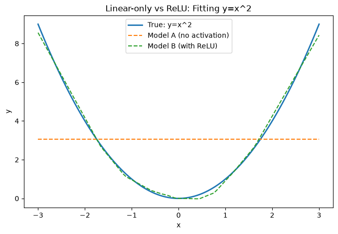

## 前提说明
- 纯线性层堆叠等价于单层线性变换

## 激活函数
- 非线性函数
- 神经网络必须要有激活函数：打破线性叠加规律，让网络具备非线性表达能力
  
## CNN中的常用激活函数：ReLU
- ReLU(x) = max(0, x)
- 输入是正数就原样输出，输入是负数就直接变成0

## 有无激活函数的区别
- 

## 总结
- 激活函数是神经网络具备"非线性拟合能力"的关键，没有它，无论网络堆多少层、参数量多大，整个网络在数学上等价于一个单层线性模型，只能拟合直线关系；加入ReLU等非线性激活函数后，网络才能拟合真实世界中普遍存在的复杂、非线性规律。