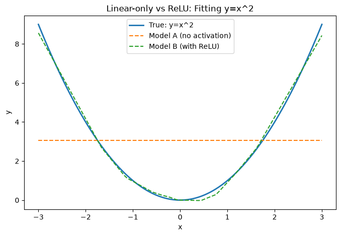

## 今日学习目标
- 理解为什么纯线性层堆叠仍然等价于一个线性模型
- 理解激活函数引入非线性表达能力的作用
- 用 `y = x ** 2` 实验对比无激活函数模型和 ReLU 模型的拟合能力

## 纯线性层堆叠的问题
- 多个 Linear 层连续堆叠，本质上仍然是线性变换
- 例如 `Linear -> Linear -> Linear` 可以合并成一个更大的线性层
- 因此没有激活函数时，网络层数再多，也只能表达线性关系

## 激活函数
- 激活函数是非线性函数，负责打破线性叠加规律
- 神经网络必须加入激活函数，才能拟合真实世界中复杂的非线性规律
- 代码中模型 A 没有激活函数，模型 B 在两层 Linear 后加入了 ReLU

## ReLU
- ReLU 公式：`ReLU(x) = max(0, x)`
- 输入大于 0 时原样输出，输入小于 0 时输出 0
- ReLU 计算简单，梯度传播稳定，是 CNN 中最常用的激活函数之一

## 实验设计
- 训练数据为 `y = x ** 2`，这是一个非线性函数
- 模型 A：`Linear -> Linear -> Linear`
- 模型 B：`Linear -> ReLU -> Linear -> ReLU -> Linear`
- 两个模型使用相同的 MSELoss 和 SGD 训练，公平比较激活函数的作用

## 实验现象
- 无激活函数模型很难拟合抛物线，预测结果更接近直线
- 加入 ReLU 后，模型可以用分段线性函数逼近曲线
- 有无激活函数的区别：

## 总结
- 激活函数是神经网络具备非线性拟合能力的关键
- 没有激活函数，无论网络堆多少层，数学上都等价于单层线性模型
- 加入 ReLU 后，网络才能拟合图像分类中复杂的边缘、纹理和语义特征

## 今日自查问题
- 为什么多个 Linear 层堆叠仍然不能拟合 `y = x ** 2`？
- ReLU 在负数区域的输出和梯度分别是什么？
- ReLU 为什么适合放在卷积层后面？
