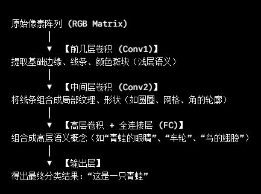

# 训练模型
- 即深度学习逻辑：给计算机输入大量的数据和对应的正确答案，计算机通过“自我学习”，自动总结出海量的复杂规则（参数权重）
- 数学本质：拟合一个超级复杂的巨型函数
- 训练就是通过不断喂入数据，寻找一组最优的参数W和b（权重与偏置），使得函数f(x;W,b)对任何一张输入的图片x算出的结果都尽可能接近真实标签的过程

# 训练过程
- 前向传播：模型根据当前权重 W 做出一批预测
- 计算损失(loss)：量化“预测答案”与“标准答案”的差距
- 反向传播：利用微积分链式法则，计算梯度
- 参数更新：优化器微调 W，使下一次预测更准
- 四步循环往复，直到loss趋于零

# 神经网络在训练时，到底“学”到了什么？（视觉特征层次）
- 在 CIFAR-10 上训练一个 CNN 时，卷积核并不是在死记硬背像素，而是在提取有层级关系的视觉特征
- 

# 泛化能力
- 过拟合：模型把训练数据死记硬背了下来，训练集Acc是 100%，但在没见过的测试集上表现极差
- 泛化能力：模型学到了通用的规律与特征，不仅在训练集上表现好，面对从未见过的全新测试图片时，依然能准确识别。

# 总结
- 模型训练的本质，是通过前向传播计算预测风险，利用反向传播与梯度下降法，在高维参数空间中寻找一组能够泛化到未见数据上的最优函数映射参数 。”