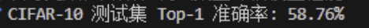

# 训练看 Loss，评估看 Accuracy
- Loss 是连续且可导的数学函数，训练阶段需要它来计算梯度
- Accuracy 是离散指标，表示预测正确样本数占总样本数的比例
- 训练时优化 Loss，评估时报告 Accuracy，这是分类任务的基本习惯

# 测试集 transform
- 测试集必须使用与训练集一致的标准化参数
- 神经网络的权重是在标准化后的数据分布上学习出来的
- 如果测试集不做同样标准化，相当于给模型输入了另一种分布的数据，评估结果会失真

# 训练集与测试集
- `train=True` 加载 CIFAR-10 训练集，用于更新模型参数
- `train=False` 加载 CIFAR-10 测试集，只用于评估泛化能力
- 测试集 `shuffle=False`，因为评估不需要打乱顺序

# model.eval()
- `model.eval()` 会把模型切换到评估模式
- Dropout 在评估模式下会关闭随机失活
- BatchNorm 在评估模式下会使用训练阶段累计的 running mean 和 running var
- 虽然 Day7 的 SimpleCNN 还没有 BN 和 Dropout，但提前养成这个习惯很重要

# with torch.no_grad()
- `with torch.no_grad()` 会关闭自动求导和计算图构建
- 测试阶段只需要前向传播，不需要反向传播
- 关闭梯度可以节省内存并提升推理速度

# Top-1 Accuracy 计算
- `outputs` 的形状是 `(batch_size, 10)`
- `torch.max(outputs, dim=1)` 会取每个样本得分最高的类别索引
- `predicted == labels` 得到一个布尔向量
- `.sum().item()` 统计当前 Batch 中预测正确的样本数
- 最终准确率公式：`correct / total * 100%`

# GPU/CPU 并行原理
- `predicted == labels` 是向量化比较，不需要手写 for 循环逐个样本判断
- Tensor 运算会尽量交给底层并行计算单元执行，因此比 Python 循环更高效

# 训练效果
- 训练效果记录：

# 今日自查问题
- 为什么测试阶段不能调用 `optimizer.step()`？
- 为什么 Accuracy 不适合作为反向传播的损失函数？
- `torch.max(outputs, dim=1)` 中的 `dim=1` 表示什么？
