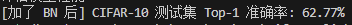

# Batch Normalization
- Batch Normalization 简称 BN，用于稳定每一层输入特征的数值分布
- 在 CNN 中常用 `nn.BatchNorm2d(num_features=C)`
- Day8 的模型在卷积层后加入 BN，形成 `Conv -> BN -> ReLU -> Pool` 的结构

# BN 的四个步骤
- 计算当前 Batch 在某个通道上的均值
- 计算当前 Batch 在某个通道上的方差
- 标准化：把特征拉回均值约为 0、方差约为 1 的分布
- 仿射变换：通过可学习参数 gamma 和 beta 恢复必要的特征表达能力

# BatchNorm2d 的统计维度
- 对形状为 `(Batch, Channel, Height, Width)` 的特征图，BN 会对每个通道单独归一化
- 对某个通道来说，BN 会在 `(Batch, Height, Width)` 这些位置上共同计算均值和方差
- 因此 `BatchNorm2d(16)` 表示有 16 个通道，每个通道各有一组 gamma 和 beta

# 为什么按通道做归一化
- 卷积层中的一个输出通道可以理解为一种特征检测器
- 同一个特征检测器在不同图片、不同空间位置上的输出，应该保持稳定的数值分布
- 按通道归一化既保留了空间结构，又稳定了特征分布

# BN 的作用
- 缓解内部协变量偏移，使深层网络更容易训练
- 允许使用相对更大的学习率，加快收敛
- 降低模型对参数初始化的敏感度
- 带来轻微正则化效果，有助于泛化

# train 和 eval 中 BN 的区别
- 训练模式下，BN 使用当前 Batch 的均值和方差
- 评估模式下，BN 使用训练过程中累计的 running mean 和 running var
- 因此带 BN 的模型评估时必须调用 `model.eval()`

# 加入 BN 后的训练效果
- 加入 BN 后训练通常更稳定，loss 下降更顺滑
- 训练效果记录：

# 今日自查问题
- `BatchNorm2d(32)` 中的 32 应该等于哪一层的通道数？
- BN 为什么通常放在 Conv 后、ReLU 前？
- 评估阶段如果忘记 `model.eval()`，BN 的行为会有什么问题？
