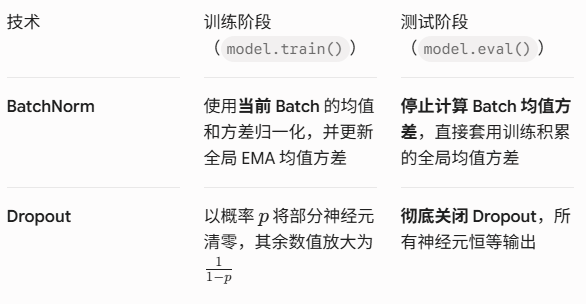

# Dropout（随机失活）
- 训练时保证数值期望不变，测试时用完整网络进行稳定预测
- 底层数学原理：Inverted Dropout（反向随机失活）
## 为什么 Dropout 能防止过拟合？
- 破除神经元间的共适应性：Dropout 随机杀掉神经元后，逼迫每一个神经元都必须独立学习有用的特征
- 集成学习的极简实现：包含N个神经元的网络，加了 Dropout 后，每次前向传播相当于从2^N种不同的子网络结构中随机抽样训练一个。最终推理时，相当于无数个微型子网络的预测结果取平均。 
## 为什么早期 Dropout 放在全连接层，而很少放在前几层卷积层？
- 全连接层占据了模型大部分参数，是过拟合的重灾区，必须强力正则化
- 卷积层的参数量很小，且高宽方向有很强的空间相关性，若直接挂 Dropout 效果较差

# 梳理
- 

# 加了Dropout的训练效果
- 